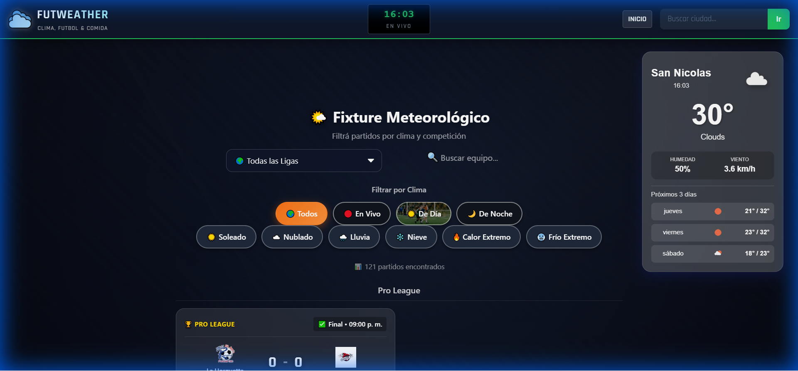

# FUTWEATHER - Clima, Fútbol & Comida ⚽🌦️🍔


**MatchDay Experience**

FutWeather is an intelligent web application that combines real-time football fixtures with live weather conditions. Plan your match day better by knowing exactly what the weather will be like at the kickoff of your favorite team's game, and discover the best local food to enjoy with the match.



---

<details open>
<summary><strong>🇪🇸 VERSIÓN EN ESPAÑOL (Click para colapsar/expandir)</strong></summary>

### ¿Qué es FutWeather?
Es una aplicación que te permite ver el fixture de fútbol mundial filtrado por clima. ¿Querés ver partidos bajo la lluvia? ¿O solo días soleados? FutWeather te muestra los partidos de hoy junto con el clima exacto en el estadio y recomendaciones gastronómicas.

### Características Principales
*   **Filtros Climáticos**: Busca partidos con condiciones específicas como Lluvia, Nieve, Sol, Calor Extremo, etc.
*   **Recomendaciones Gastronómicas**: Descubrí comidas típicas y sugerencias ideales para acompañar el partido según el clima o la región.
*   **Buscador de Equipos**: Encontrá tu equipo y mirá cuándo juega y qué clima hará.
*   **Fixture en Vivo**: Resultados y estado de los partidos en tiempo real.
*   **Clima Local**: Tu ubicación actual anclada para saber el clima donde estás.
*   **Cobertura Mundial**: Datos de todas las ligas del mundo (Champions, Libertadores, Premier, La Liga, etc.).

### Tecnologías Usadas
*   **Frontend**: React.js
*   **Lenguaje**: JavaScript (ES6+)
*   **Estilos**: CSS3 Avanzado (Glassmorphism, Responsive Design)
*   **APIs**:
    *   **OpenWeatherMap**: Para datos climáticos en tiempo real.
    *   **API-Football (RapidAPI)**: Para datos de partidos, equipos y estadios.
    *   **Spoonacular API**: Para datos de recetas y comidas.
*   **Routing**: React Router DOM (v5)

### Instalación
1.  Clonar el repositorio:
    ```bash
    git clone https://github.com/tu-usuario/the-Weather-App.git
    ```
2.  Instalar dependencias:
    ```bash
    npm install
    ```
3.  Configurar variables de entorno:
    Crea un archivo `.env` en la raíz y agrega tu API Key:
    ```
    REACT_APP_API_KEY=tu_api_key_aqui
    ```
4.  Iniciar la aplicación:
    ```bash
    npm start
    ```
</details>

<br>

<details>
<summary><strong>🇬🇧 ENGLISH VERSION (Click to expand/collapse)</strong></summary>

### What is FutWeather?
An app that combines global football schedules with weather filtering. Want to watch a rainy match? Or avoid the heat? FutWeather shows today's matches alongside the precise weather conditions at the stadium and food pairings.

### Key Features
*   **Weather Filters**: Filter matches by Rain, Snow, Sun, Mist, etc.
*   **Gastronomy**: Discover typical foods and pairing suggestions based on the weather or match region.
*   **Team Search**: Find any team worldwide and see their next match weather.
*   **Live Scores**: Real-time match status.
*   **Local Weather**: Pinned card showing your current local conditions.
*   **Global Coverage**: All major leagues included.

### Tech Stack
*   **Frontend**: React.js
*   **Language**: JavaScript
*   **Styling**: CSS3, Glassmorphism UI
*   **APIs**: OpenWeatherMap, API-Football, Spoonacular API
*   **Routing**: React Router DOM

### Deployment
This project includes a `vercel.json` configuration for easy deployment on Vercel.

1.  Push your code to GitHub.
2.  Import the project into Vercel.
3.  Add your Environment Variables in the Vercel dashboard.
4.  Deploy!
</details>
